# From Black-Box to Explainability: Probabilistic Automata for Time Series Analysis

> Yazılım Geliştirme Dersi — 2. Proje  
> Kocaeli Üniversitesi

## İçindekiler

1. [Proje Tanımı](#proje-tanımı)
2. [Veri Setleri](#veri-setleri)
3. [Kurulum](#kurulum)
4. [Kullanım](#kullanım)
5. [Yazılım Mimarisi](#yazılım-mimarisi)
6. [Modeller](#modeller)
7. [Deneysel Sonuçlar](#deneysel-sonuçlar)
8. [İstatistiksel Analiz](#istatistiksel-analiz)
9. [Açıklanabilirlik Modülü](#açıklanabilirlik-modülü)
10. [Parametre Analizi](#parametre-analizi)
11. [Görseller](#görseller)

---

## Proje Tanımı

Bu projede zaman serisi anomali tespiti için iki farklı modelleme yaklaşımı karşılaştırılmaktadır:

- **Derin Öğrenme Modelleri** (LSTM, GRU, 1D-CNN): Yüksek doğruluk potansiyeline sahip ancak kararlarını açıklayamayan *black-box* modeller
- **Probabilistic Automata**: PAA + SAX dönüşümleri üzerine kurulu, her kararı olasılıksal geçişlerle açıklayabilen yorumlanabilir model

Modeller yalnızca performans değil; gürültüye dayanıklılık, unseen veri davranışı ve açıklanabilirlik kriterleri açısından da analiz edilmektedir.

**Araştırma sorusu:** *Farklı modelleme yaklaşımları, zaman serisi verileri üzerinde farklı veri koşulları altında nasıl davranmaktadır ve bu davranışlar istatistiksel olarak anlamlı mıdır?*

---

## Veri Setleri

### SKAB (Skoltech Anomaly Benchmark)
- Kaynak: `data/raw/SKAB/valve1/` ve `valve2/` klasörleri
- Tüm `.csv` dosyaları birleştirildi; `source_group` ve `source_file` takip sütunları eklendi
- Hedef değişken: `anomaly` (0=normal, 1=anomali)
- Model girdisi dışı sütunlar: `datetime`, `changepoint`, `source_group`, `source_file`
- Değerlendirme: **StratifiedGroupKFold** (5 fold, `source_file` grup değişkeni)

### BATADAL (Battle of the Attack Detection ALgorithms)
- Kaynak: `data/raw/BATADAL/BATADAL_dataset04.csv` (Training Dataset 2)
- Hedef değişken: `ATT_FLAG` (-999 → 0 normal, 1 → saldırı)
- Zaman sütunu (`DATETIME`) model girdisi dışı tutuldu
- Değerlendirme: **Zaman sıralı bölme** — %60 eğitim / %20 doğrulama / %20 test

---

## Kurulum

```bash
# Bağımlılıkları yükle
pip install -r requirements.txt

# Veri setlerini aşağıdaki konumlara koy:
# data/raw/SKAB/valve1/*.csv
# data/raw/SKAB/valve2/*.csv
# data/raw/BATADAL/BATADAL_dataset04.csv
```

---

## Kullanım

```bash
# Tüm modelleri çalıştır (DL + Automata)
python main.py --dataset both --model all --output-dir results

# Sadece DL modelleri
python main.py --dataset both --model dl --output-dir results

# Sadece Automata
python main.py --dataset both --model automata --output-dir results

# Parametre analizi (window_size x alphabet_size)
python main.py --param-analysis --dataset batadal --output-dir results

# DL görsellerini üret
python generate_plots.py

# Automata görsellerini üret (state diagram, heatmap vb.)
python generate_automata_plots.py

# İstatistiksel testleri çalıştır
python run_statistical_tests.py

# Birim testleri çalıştır
python -m pytest tests/
```

---

## Yazılım Mimarisi

```
yazlab2proje2/
├── config/
│   └── config.yaml          # Merkezi konfigürasyon (hard-coded değer yok)
├── src/
│   ├── config.py             # Config dataclass'ları
│   ├── data/
│   │   ├── loader.py         # SKAB + BATADAL veri yükleyiciler
│   │   └── preprocessor.py  # Normalizasyon, PCA, bölme, GroupKFold
│   ├── models/
│   │   ├── lstm_model.py     # PyTorch LSTM
│   │   ├── gru_model.py      # PyTorch GRU
│   │   ├── cnn_model.py      # PyTorch 1D-CNN
│   │   ├── trainer.py        # Eğitim döngüsü, loglama, sonuç kaydetme
│   │   └── _train_utils.py   # Paylaşılan eğitim fonksiyonu
│   ├── automata/
│   │   ├── paa.py            # Piecewise Aggregate Approximation
│   │   ├── sax.py            # Symbolic Aggregate approXimation
│   │   ├── levenshtein.py    # Edit distance + unseen pattern yönetimi
│   │   ├── automata.py       # Probabilistic Automata ana modeli
│   │   └── explainability.py # Açıklanabilirlik modülü
│   ├── experiments/
│   │   ├── runner.py         # Deney koşturucu (DL + Automata)
│   │   └── noise.py          # Gaussian gürültü ekleme
│   ├── evaluation/
│   │   ├── metrics.py        # Accuracy, Precision, Recall, F1
│   │   └── statistical.py    # Wilcoxon + McNemar testleri
│   └── visualization/
│       ├── plots.py          # DL görsel fonksiyonları
│       └── automata_plots.py # Automata görsel fonksiyonları
├── tests/
│   ├── test_data.py          # Veri pipeline birim testleri
│   └── test_automata.py      # PAA, SAX, Levenshtein birim testleri (31 test)
├── main.py                   # Ana giriş noktası
├── generate_plots.py         # DL görsel üretici
├── generate_automata_plots.py# Automata görsel üretici
└── run_statistical_tests.py  # McNemar istatistiksel testler
```

**Temel tasarım kararları:**
- Tüm parametreler `config/config.yaml`'da — hiçbir yerde hard-coded değer yok
- Scaler ve PCA yalnızca train verisiyle `fit` edilir (data leakage önleme)
- DL modelleri 5 PCA bileşeni, Automata modeli PC1 (1 bileşen) kullanır
- Sınıf dengesizliği: DL modellerinde `pos_weight = n_neg / n_pos` ile ağırlıklı BCELoss

---

## Modeller

### Derin Öğrenme Modelleri

| Parametre | Değer |
|-----------|-------|
| Epoch üst sınırı | 50 |
| Batch size | 32 |
| Early stopping patience | 5 (val_loss) |
| Random seed | 42, 123, 2026, 7, 999 |
| Sequence length | 30 |
| PCA bileşen sayısı | 5 |
| Optimizör | Adam |

### Probabilistic Automata

| Parametre | Değer |
|-----------|-------|
| Window size | 4 (varsayılan) |
| Alphabet size | 3 (varsayılan) |
| PCA bileşen sayısı | 1 (PC1) |
| Smoothing | Laplace (α=1e-6) |
| Unseen yönetimi | Levenshtein edit distance |

**Akış:** Ham seri → PAA → SAX → Sliding Window → Pattern (State) → Geçiş Olasılıkları → Anomali Skoru

---

## Deneysel Sonuçlar

### BATADAL Sonuçları

| Model | Senaryo | F1 (mean ± std) | Accuracy | Precision | Recall |
|-------|---------|-----------------|----------|-----------|--------|
| LSTM | Original | 0.5813 ± 0.0717 | 0.8720 | 0.4747 | 0.8425 |
| LSTM | Noisy | 0.5462 ± 0.0986 | 0.8352 | 0.4141 | 0.9075 |
| GRU | Original | 0.5704 ± 0.0572 | 0.8486 | 0.4045 | 0.9850 |
| GRU | Noisy | 0.5616 ± 0.0464 | 0.8452 | 0.3958 | 0.9800 |
| CNN | Original | 0.4666 ± 0.0899 | 0.7717 | 0.3120 | 0.9575 |
| CNN | Noisy | 0.4270 ± 0.0840 | 0.7352 | 0.2788 | 0.9500 |
| **Automata** | Original | 0.1556 | 0.6364 | 0.1000 | 0.3500 |
| **Automata** | Noisy | 0.1978 | 0.6507 | 0.1268 | 0.4500 |
| **Automata** | Unseen | 0.1556 | 0.6364 | 0.1000 | 0.3500 |

### SKAB Sonuçları (5-Fold Ortalama)

| Model | Senaryo | F1 (mean ± std) | Accuracy | Precision | Recall |
|-------|---------|-----------------|----------|-----------|--------|
| LSTM | Original | 0.8938 ± 0.0395 | 0.9275 | 0.9216 | 0.8735 |
| LSTM | Noisy | 0.8880 ± 0.0483 | 0.9236 | 0.9172 | 0.8681 |
| GRU | Original | **0.9025 ± 0.0377** | 0.9332 | 0.9295 | 0.8810 |
| GRU | Noisy | 0.8921 ± 0.0414 | 0.9267 | 0.9261 | 0.8682 |
| CNN | Original | 0.8977 ± 0.0471 | 0.9284 | 0.9188 | 0.8830 |
| CNN | Noisy | 0.8949 ± 0.0463 | 0.9263 | 0.9145 | 0.8817 |
| **Automata** | Original | 0.4645 ± 0.0171 | 0.4150 | 0.3411 | 0.7287 |
| **Automata** | Noisy | 0.4688 ± 0.0149 | 0.4167 | 0.3434 | 0.7392 |
| **Automata** | Unseen | 0.4645 ± 0.0171 | 0.4150 | 0.3411 | 0.7287 |

### Veri Setleri Arası Karşılaştırma

DL modelleri SKAB'da belirgin şekilde daha iyi performans göstermektedir (F1 ~0.90 vs ~0.58). BATADAL'da sınıf dengesizliği (yaklaşık %12 anomali) ve yüksek boyutlu sensör verisi (43 özellik → 5 PCA bileşeni) zorluğu artırmaktadır. Automata modeli PC1 tek bileşenle çalıştığından BATADAL'da bilgi kaybı daha yüksektir.

### Gürültü Etkisi Analizi

Gaussian gürültü (std=0.1) eklendiğinde:
- **DL modelleri:** F1'de ortalama ~0.03-0.05 düşüş — yüksek dayanıklılık
- **Automata:** BATADAL'da F1 hafif artış (0.1556 → 0.1978), SKAB'da minimal değişim — gürültü bazı durumlarda anomali skorunu değiştiriyor

Genel olarak her iki model tipi de Gaussian gürültüye karşı dayanıklıdır.

### Unseen Veri Davranışı

Automata modelinde test sırasında eğitim SAX sözlüğünde bulunmayan pattern'larla karşılaşıldığında Levenshtein edit distance ile en yakın bilinen pattern bulunur:
- BATADAL: Unseen oranı ~%3 (76 state)
- SKAB: Unseen oranı ~%0.4 (36 state)

Unseen senaryo ile original senaryo arasında performans farkı gözlemlenmemiştir — Levenshtein eşleştirme mekanizması etkin çalışmaktadır.

---

## İstatistiksel Analiz

Model farklarının istatistiksel anlamlılığı **McNemar testi** ile değerlendirilmiştir (örnek bazlı karşılaştırma, seed=42).

### BATADAL

| Karşılaştırma | Original p-değeri | Noisy p-değeri |
|---------------|-------------------|----------------|
| LSTM vs GRU | p < 0.0001 ✓ | p < 0.0001 ✓ |
| LSTM vs CNN | p = 0.0055 ✓ | p < 0.0001 ✓ |
| GRU vs CNN | p = 0.0002 ✓ | p = 0.0001 ✓ |

### SKAB

| Karşılaştırma | Original p-değeri | Noisy p-değeri |
|---------------|-------------------|----------------|
| LSTM vs GRU | p = 0.0002 ✓ | p = 0.0002 ✓ |
| LSTM vs CNN | p = 0.0002 ✓ | p < 0.0001 ✓ |
| GRU vs CNN | p = 0.6728 ✗ | p = 0.0342 ✓ |

**Yorum:** BATADAL'da tüm model çiftleri anlamlı farklılık göstermektedir. SKAB'da GRU ve CNN benzer performans sergilemekte (original senaryoda p=0.67, anlamsız), bu durum iki modelin bu veri setinde neredeyse eşdeğer olduğuna işaret etmektedir.

> **Not:** Wilcoxon testi n=5 seed ile minimum p=0.0625 üretemediğinden (matematiksel sınır), daha güçlü olan McNemar testi tercih edilmiştir.

---

## Açıklanabilirlik Modülü

Automata modeli her karar için aşağıdaki bilgileri üretmektedir:

```json
{
  "time_step": 5,
  "state": "aab",
  "pattern": "adc",
  "status": "unseen",
  "mapped_to": "abc",
  "distance": 1,
  "transitions": {
    "aab->abc": 0.72
  },
  "transition_probability": 0.72,
  "state_anomaly_rate": 0.031,
  "anomaly_score": 0.412,
  "probability": 0.72,
  "decision": "normal",
  "confidence": 0.908
}
```

**Güven skoru** hesaplaması: `1.0 - |anomaly_score - threshold|`

**Anomali skoru** iki sinyal birleştirilerek hesaplanır:
- State anomali oranı (eğitimden öğrenilir): `0.6 × state_anomaly_rate`
- Geçiş beklenmedikliği: `0.4 × (1 - transition_probability)`

**Path probability:** Ardışık geçiş olasılıklarının çarpımı — `P(sequence) = ∏ P(Si → Si+1)`

---

## Parametre Analizi

Automata modeli için window_size × alphabet_size kombinasyonları BATADAL verisi üzerinde test edilmiştir:

| window_size | alphabet_size | F1 | State Sayısı | Geçiş Yoğunluğu |
|-------------|---------------|----|--------------|-----------------|
| 3 | 3 | 0.2081 | 26 | 0.1050 |
| 4 | 3 | 0.1522 | 76 | 0.0260 |
| 5 | 5 | 0.2127 | 367 | 0.0032 |
| 6 | 3 | **0.2440** | 200 | 0.0065 |
| 6 | 6 | 0.1718 | 375 | 0.0028 |

**Gözlemler:**
- Alphabet size artışı → daha fazla state → geçiş yoğunluğu düşer
- En iyi F1: ws=6, as=3 (0.2440) — küçük alfabe ile geniş pencere en iyi dengeyi sağlıyor
- Yüksek state sayısı modeli daha açıklayıcı yapar ancak seyrek geçiş matrisine yol açar

---

## Görseller

### Model Karşılaştırmaları

**BATADAL — DL vs Automata**
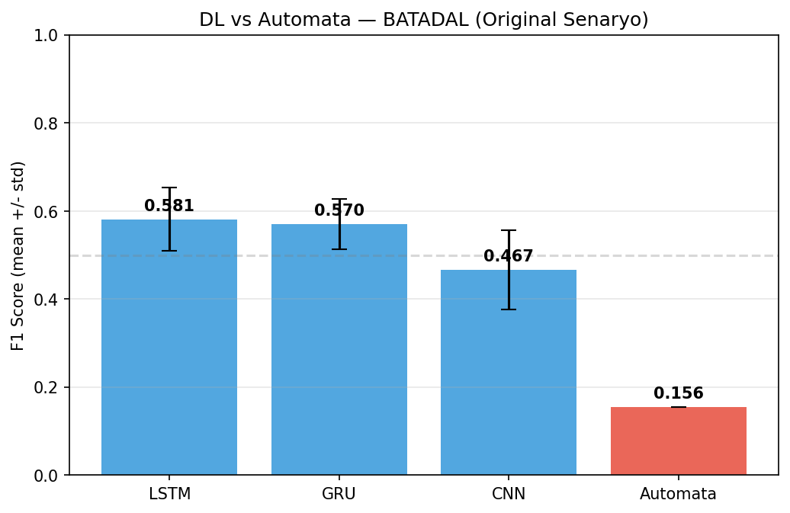

**SKAB — DL vs Automata**
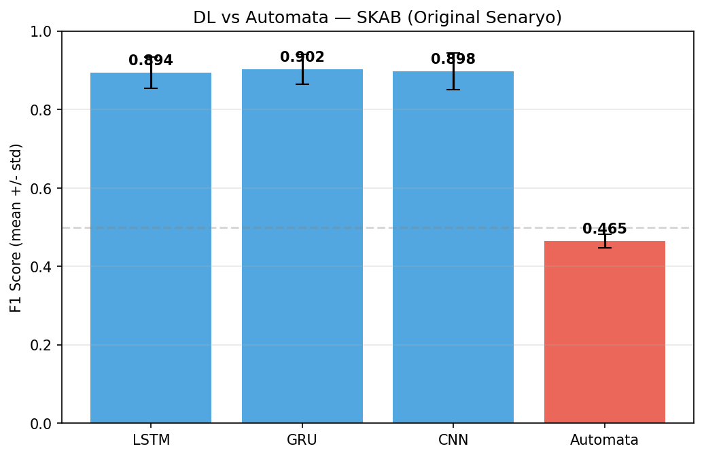

**Cross-Dataset Karşılaştırma**
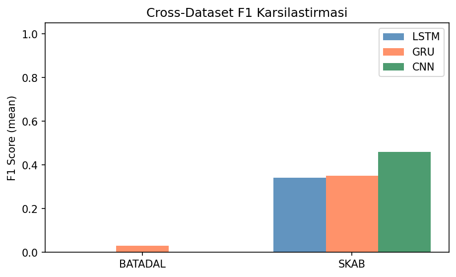

---

### Confusion Matrix

**LSTM — BATADAL (Original)**
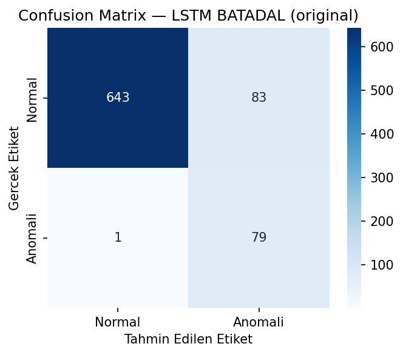

**GRU — SKAB (Original)**
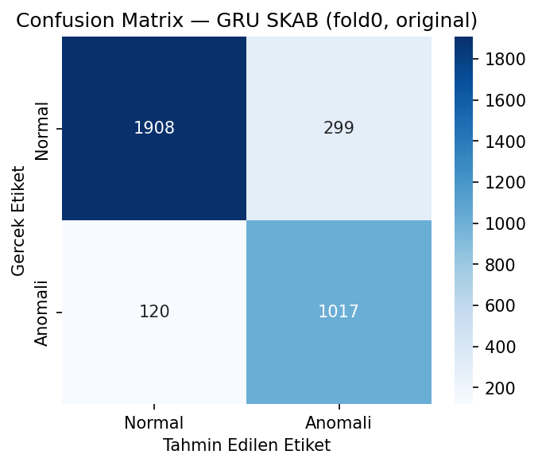

---

### ROC Eğrileri

**LSTM — BATADAL**
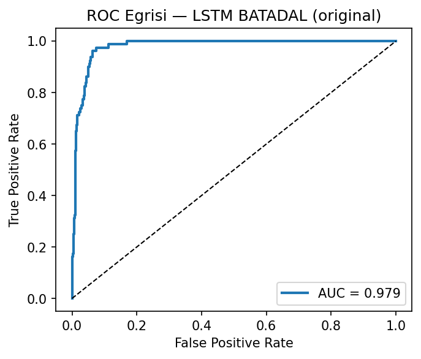

**GRU — SKAB**
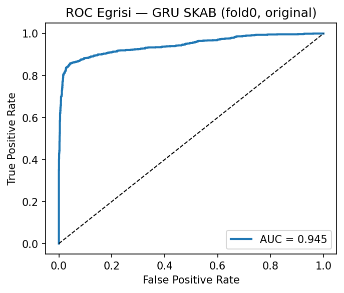

---

### Automata State Diagram

**BATADAL** — Düğüm rengi anomali oranını gösterir (yeşil=normal, kırmızı=anomali)
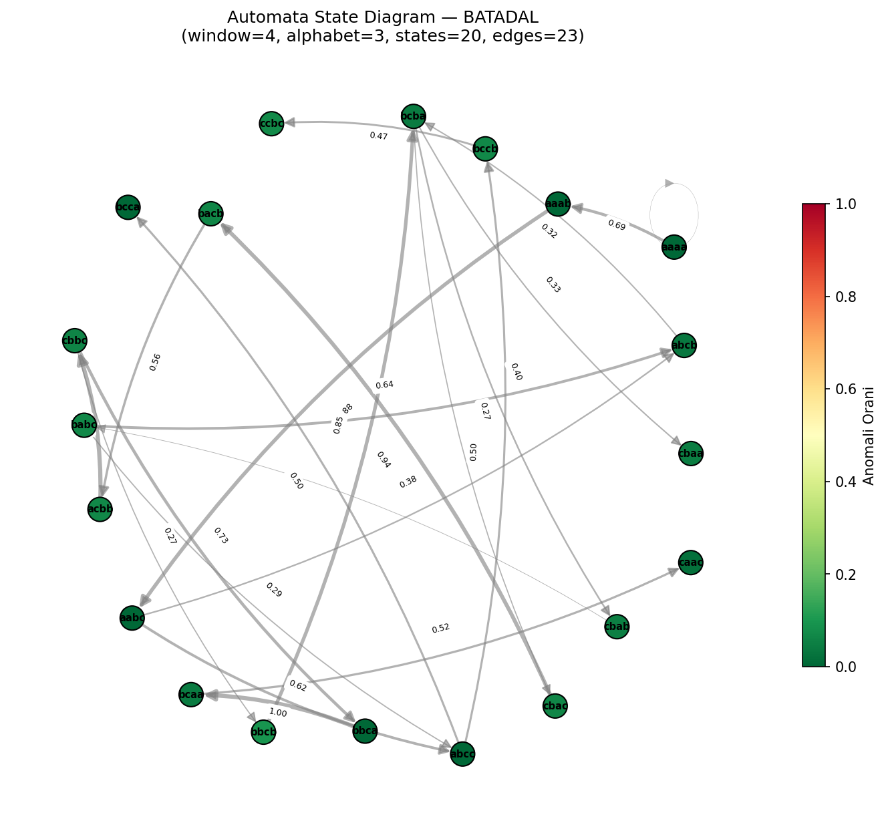

**SKAB**
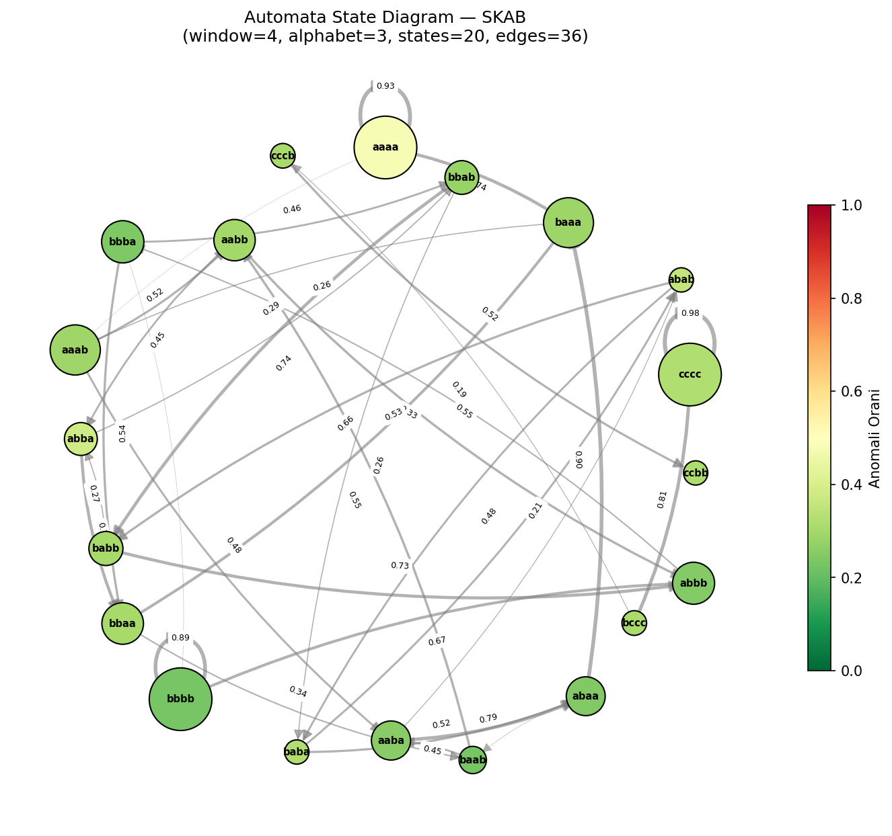

---

### Transition Probability Heatmap

**BATADAL**
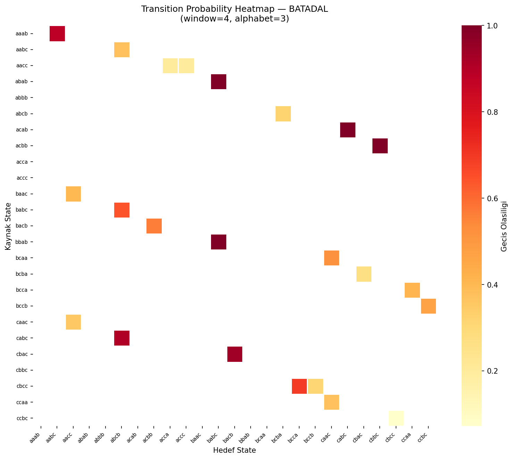

**SKAB**
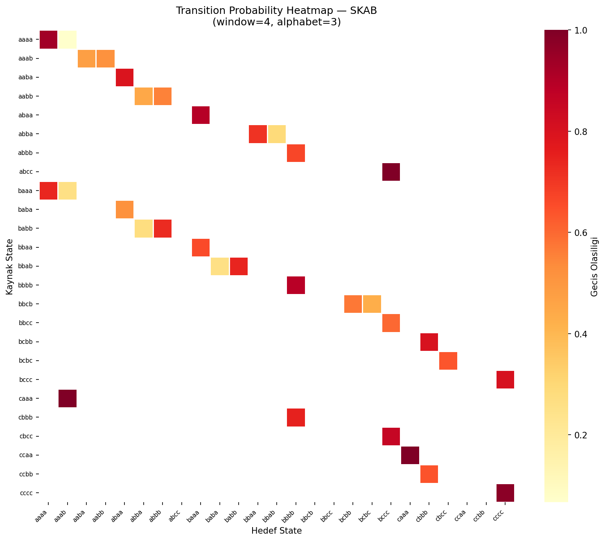

---

### Parametre Duyarlılık Grafikleri

**BATADAL — F1 Heatmap (Window Size × Alphabet Size)**
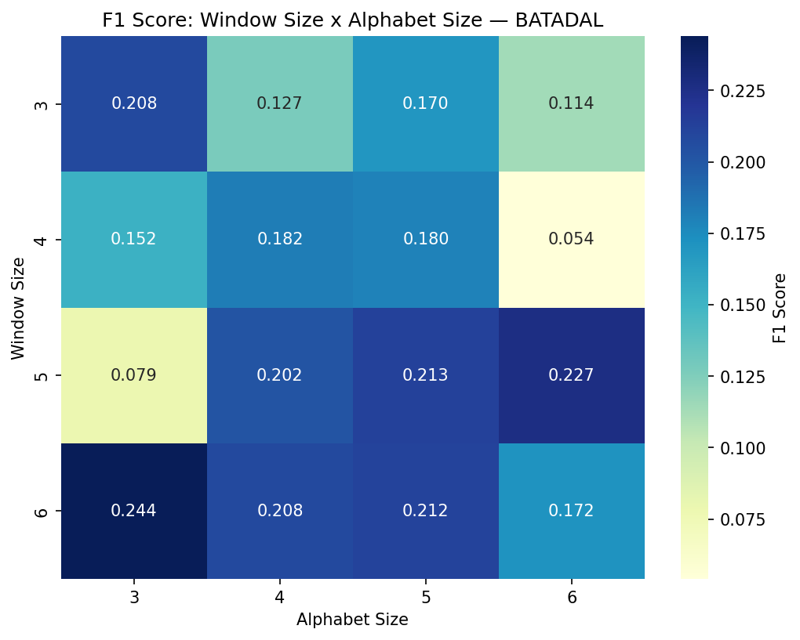

**BATADAL — State Sayısı Heatmap**
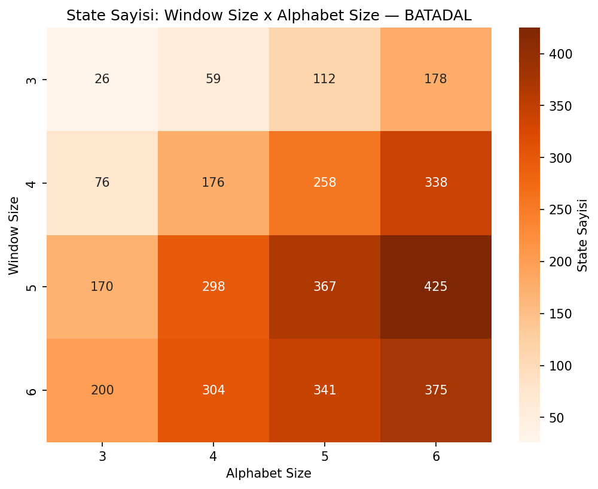

**BATADAL — Parametre Duyarlılık Çizgi Grafiği**
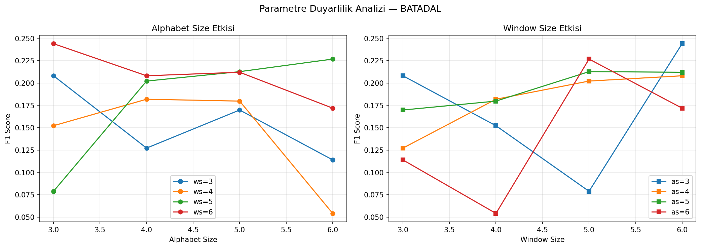

---

### Gürültü Etkisi

**BATADAL**
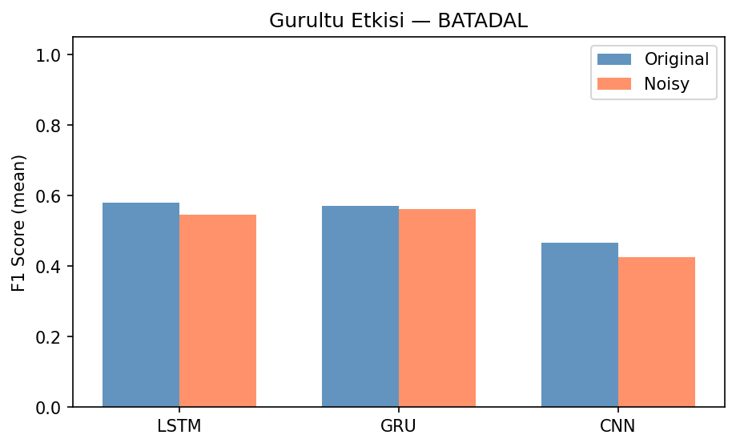

**SKAB**
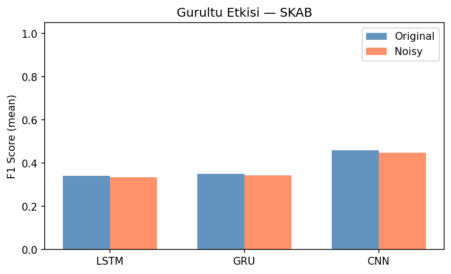

---

## Ekip

| Kişi | Görev |
|------|-------|
| Kerem Ünal | DL modelleri (LSTM, GRU, CNN), veri pipeline, görselleştirme, istatistiksel testler |
| Efekan Tosmak | Probabilistic Automata, açıklanabilirlik modülü, parametre analizi |
